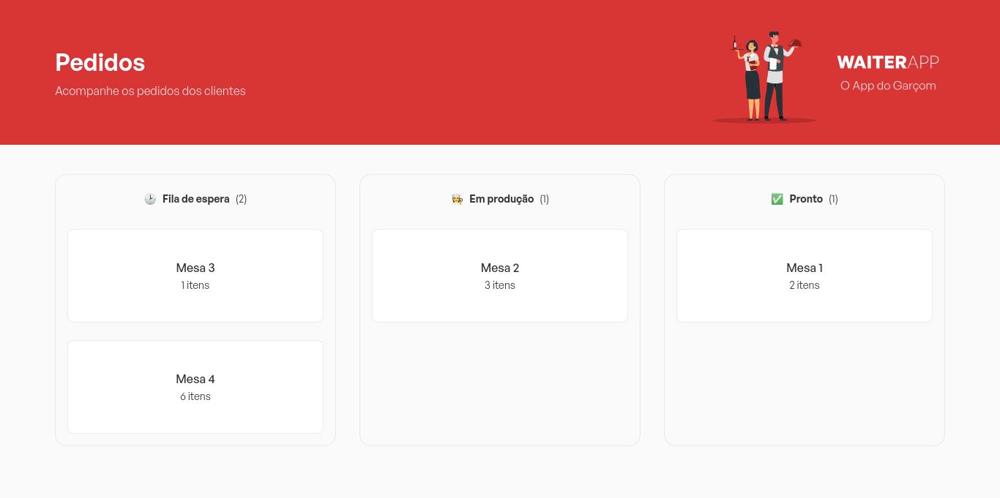

# WaiterApp Web

<p align="center">
  
</p>

WaiterApp, o App do Garçom, descarta a necessidade de comandas físicas em restaurantes e bares. O aplicativo permite que o garçom realize pedidos e os envie diretamente para a cozinha, onde haverá um painel para acompanhar e atualizar os pedidos.

O aplicativo traz consigo, pelo menos, 3 vantagens:
1. **Organização dos pedidos**: como o aplicativo descarta a necessidade de papel, preocupações com disponibilidade de espaço e estoque de comandas não existem. Além disso, o aplicativo já organiza os pedidos em ordem de chegada.
2. **Agilidade**: sem a necessidade de anotar o pedido à mão e ir até a cozinha, o tempo que o garçom gasta realizando um pedido é menor.
3. **Redução de erros**: evita erros ao anotar os pedidos, perda de comanda, ordenação errada dos pedidos, entre outros.

Este é o repositório da aplicação web, que fica na cozinha. O repositório do aplicativo mobile, que fica com o garçom, pode ser acessado [aqui](https://github.com/nataelienai/waiterapp-mobile).

Este projeto foi desenvolvido durante o curso [JStack](https://jstack.com.br/).

## Tecnologias

- Linguagem: TypeScript
- Gerenciador de pacotes: pnpm
- Bibliotecas: React, Styled Components, Socket.IO, Axios e React-Toastify
- Ferramentas: Vite, ESLint, Prettier, EditorConfig, commitlint, lint-staged, husky, Git e Figma

## Dependências

Antes de tudo, é necessário estar com a [API](https://github.com/nataelienai/waiterapp-api) do projeto já em execução para que esta aplicação funcione.

Como o [aplicativo mobile](https://github.com/nataelienai/waiterapp-mobile) é responsável pela criação de pedidos, é recomendável executá-lo também. Sem pedidos, não é possível realizar nenhuma ação na aplicação web.

Para executar esta aplicação, você precisará de [Git](https://git-scm.com/downloads) e [Node.js](https://nodejs.org/) instalados no seu computador.

## Como executar

1. Abra um terminal e clone o repositório:
```sh
git clone https://github.com/nataelienai/waiterapp-web.git
```

2. Entre na pasta do repositório clonado:
```sh
cd waiterapp-web
```

3. Instale o pnpm (caso não o tenha):
```sh
npm install -g pnpm
```

4. Instale as dependências do projeto:
```sh
pnpm install
```

5. Inicialize a aplicação:
```sh
pnpm dev
```
